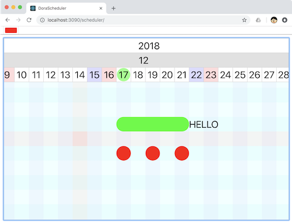

# Dora Engine

ラズベリーパイと [RasPi-VoiceBot](https://yamagame.github.io/dora-board) で作るコミュニケーションロボットエンジンです。

<p align="center">
  
</p>

## 特徴

- 音声認識、音声合成機能を持つ Raspberry Pi を使った手作りできるコミュニケーションロボットです。
- 部品代は AquesTalk Pi を含めて 2 万円ほどです。
- 専用スクリプト言語を使ってロボットのコントロールを簡単に行えます。
- 外部のパソコンなしにロボット単体で画像と連携したプレゼンテーションができます。
- 外装はダンボールですのでお好みに合わせて自由に変更できます。
- 言語の翻訳機能を持たせることもできます。

### 音声認識

音声認識には [Google Speech-to-Text](https://cloud.google.com/speech-to-text/) を使っています。[Google Speech-to-Text](https://cloud.google.com/speech-to-text/) はマイクに入力した音声を文字列に変換するサービスです。
[Google Speech-to-Text](https://cloud.google.com/speech-to-text/) を使うことで以下のことができます。

- 多言語認識：日本語だけでなく外国語の認識もできます。
- 言語判定：入力した音声がどの言語のものなのかを判定できます。

### 音声合成

音声合成には以下のものを選択できます。

- [Open JTalk](http://open-jtalk.sp.nitech.ac.jp/)
- [AquesTalk Pi](https://www.a-quest.com/products/aquestalkpi.html)
- [Google Text-to-Speech](https://cloud.google.com/text-to-speech/)
- [AWS Polly](https://aws.amazon.com/jp/polly/)

[Google Text-to-Speech](https://cloud.google.com/text-to-speech/) や [AWS Polly](https://aws.amazon.com/jp/polly/) を使うと外国語を話すことができます。

### 言語翻訳

言語翻訳には [Google Translation API](https://cloud.google.com/translate/) を使用します。

### 頭部の稼働

サーボモーター２つを使って頭が上下左右に動きます。頭の動きは自動的に行われます。何も指示がないときにはロボットの頭部は上下左右にランダムに動きます。ロボットがおしゃべりしているときは頭が上下に動きます。

### 専用スクリプト言語 ([DoraScript](https://github.com/yamagame/dora))

専用のスクリプト言語を使ってシナリオを作成できます。シナリオで音声認識や音声合成、プレゼンテーション画面の切り替え、お腹のボタンのコントロールなどができます。シナリオはブラウザベースのエディタを使って編集できます。特定のシナリオを電源投入時に自動的に実行することもできます。

### プレゼンテーション

おしゃべりと連携してプレゼンテーション画像を表示することができます。プレゼンテーション画面は Raspberry Pi のブラウザに表示されます。外部モニタを接続することで Raspberry Pi の画面を表示することができますので、外部のパソコンなしにロボット単体でプレゼンテーションができます。

## ロボットの設計図

設計図は 1.5mm 厚ダンボール用と 3mm 厚ダンボール用の２つがあります。
ロボットは設計図の各ページを A4 サイズで印刷して、厚紙パーツはそのまま切り取り、ダンボールパーツはダンボールに貼り付けて切り取ります。

- 3mm 厚ダンボール用

  [http://bit.ly/2LkGgn4](http://bit.ly/2LkGgn4)

- 1.5mm 厚ダンボール用

  [http://bit.ly/2mmmfBG](http://bit.ly/2mmmfBG)

設計図は[クリエイティブコモンズライセンス](https://creativecommons.org/)で公開しています。

ロボットの組立方法は以下のリンク先のページを参考にしてください。

- [ロボット組立方法](http://bit.ly/2zTPUfn)

### サーボモーターについて

ダンボールロボットの設計図はマイクロサーボを２つ使う設計になっています。一つは頭部を左右に、もう一つは上下に動かします。しかし、Servo MG90D の様なマイクロサーボは稼働させ続けると壊れやすい様です。長時間動かす場合はマイクロサーボではなく、MG996R の様な大きめのサーボをオススメします。

[秋月電子：TowerPro MG996R](http://akizukidenshi.com/catalog/g/gM-12534/)

MG996R ではダンボールロボットのサイズに合いませんので上下の動きは諦めて左右の動きのサーボとして使用します。

## 準備

Raspberry Pi のホームページから [Raspbian](https://www.raspberrypi.org/downloads/) をダウンロードして、Raspbian の入った microSD カードを作成します。

Raspberry Pi のターミナルで、以下のコマンドを入力して、ロボットエンジンをダウンロードします。

```
$ cd ~
$ git clone https://github.com/yamagame/dora-engine
```

dora-engine フォルダに移動して、setup-system.sh を実行します。

```
$ cd dora-engine
$ ./setup-system.sh
```

setup-nodejs.sh で Node.js をセットアップします。

```
$ ./setup-nodejs.sh
```

setup-open-jTalk.sh で Open JTalk をセットアップします。

```
$ ./setup-open-jTalk.sh
```

setup-autolaunch.sh で、自動起動の設定を行います。

```
$ ./setup-autolaunch.sh
```

再起動します。

### /boot/config.txt を編集する

以下の項目をコメントアウトして無効化します。

```
dtparam=audio=on
```

以下の３項目を記入して有効化します。

```
dtparam=i2s=on
dtoverlay=i2s-mmap
dtoverlay=googlevoicehat-soundcard
```

### /etc/asound.conf を作成

```
options snd_rpi_googlemihat_soundcard index=0

pcm.softvol {
    type softvol
    slave.pcm dmix
    control {
        name Master
        card 0
    }
}

pcm.micboost {
    type route
    slave.pcm dsnoop
    ttable {
        0.0 10
        1.1 10
    }
}

pcm.!default {
    type asym
    playback.pcm "plug:softvol"
    capture.pcm "plug:micboost"
}

ctl.!default {
    type hw
    card 0
}
```

## マイクとスピーカーをテストする

### 録音する場合

```
$ arecord -Dplug:micboost -f S16_LE -r 16000 test.wav
```

### 再生する場合

```
$ aplay -Dplug:softvol test.wav
```

## AquesTalk Pi の準備

デフォルトの音声合成は Open JTalk になってます。AquesTalk Pi を使用する場合は以下の手順で準備します。

ブラウザで以下の URL を開きます。

[https://www.a-quest.com/products/aquestalkpi.html](https://www.a-quest.com/products/aquestalkpi.html)

Download のセクションから、使用許諾を読んで「同意して Download」ボタンをクリックします。

Downloads フォルダに aquestalkpi-20220207.tar がダウンロードされますので、以下のコマンドでダウンロードしたファイルを DoraEngine のプロジェクトルートの modules ディレクトリに移動して解凍します。

```
$ mv ~/Downloads/aquestalkpi-20220207.tar ./modules
$ pushd modules
$ tar xvf aquestalkpi-20220207.tar
$ popd
```

以下のコマンドを入力して、音声合成のテストを行います。

```
$ cd ~/dora-engine
$ ./talk-f1.sh こんにちは
```

音声合成を Open JTalk から変更する場合は、環境変数 ROBOT_DEFAULT_VOICE の設定を外します。

[robot-server.sh](./robot-server.sh) の以下の行のコメントアウトします。

```
#export ROBOT_DEFAULT_VOICE=open-jTalk
```

再起動後、デフォルト音声合成が AquesTalk Pi になります。

## 音声認識

[Google Speech API](https://cloud.google.com/speech-to-text?hl=ja) と　[whisper.cpp](https://github.com/ggerganov/whisper.cpp) が選択できます。


## 音声認識 whisper.cpp の場合

whisper.cpp の使用方法は whisper.cpp に従いますので、whisper.cpp の README.md を参照してください。

/work ディレクトリに https://github.com/ggerganov/whisper.cpp を clone します。
/work/whisper.cpp ディレクトリで以下のコマンドを実行して、stream バイナリを作成します。

```bash
$ make stream
```

音声認識のモデルデータを以下のコマンドでダウンロードします。

```bash
$ bash ./models/download-ggml-model.sh base.en
```

環境変数 SPEECH に whisper を設定して音声認識を有効化します。[robot-server.sh](./robot-server.sh) の以下の行を書き換えます。

```
export SPEECH=whisper
```

## 音声認識 Google Speech API の場合

環境変数 GOOGLE_APPLICATION_CREDENTIALS に使用する Google Cloud Project の認証ファイルへのパスを指定します。

認証ファイル (JSON ファイル) の取得方法については以下を参照してください。

[https://cloud.google.com/speech-to-text/docs/quickstart-client-libraries](https://cloud.google.com/speech-to-text/docs/quickstart-client-libraries)

プロジェクトの Speech API を有効にします。

環境変数 SPEECH の設定を削除して音声認識を有効化します。[robot-server.sh](./robot-server.sh) の以下の行のコメントアウトします。

```
#export SPEECH=off
```

音声認識のテストを行います。以下のコマンドをシナリオエディタに入力してエコーロボットになれば OK です。音声認識している最中はお腹のボタンが点灯します。

```
/speech-to-text
/text-to-speech
```

[Google Text-to-Speech](https://cloud.google.com/text-to-speech/) は最長で 60 秒間音声認識します。60 秒以上になるとエラーになります。そのため、DoraEngine では初期設定では 30 秒で音声認識はタイムアウトします。

## Google Translation API の準備

環境変数 GOOGLE_APPLICATION_CREDENTIALS で指定したプロジェクトの Translation API を有効にします。

環境変数 ROBOT_GOOGLE_TRANSLATE_PROJECT_ID に Google Cloud Project の ProjectID を設定します。

## プレゼンテーション画面

<p align="center">
  
</p>

ブラウザで以下の URL を開きます。

```
http://[dora-engineのIPアドレス]:3090/
```

この画面にコマンドで指示したスライドなどが表示されます。シナリオを作ることでスライドと連動したプレゼンテーションロボットとして稼働させることができます。

## シナリオエディター画面

<p align="center">
  
</p>

シナリオエディターを使ってロボットをコントロールすることができます。

ブラウザで以下の URL を開きます。

```
http://[dora-engineのIPアドレス]:3090/scenario-editor/
```

あなたのお名前のエリアに名前を入力します。名前はなんでもよいです。

テキストエディターが開きますので、そこに適当に会話文書を入力します。

会話文について詳しくは、[こちら](https://github.com/yamagame/dora)を参照。

## スケジューラ画面

<p align="center">
  
</p>

ブラウザで以下の URL を開きます。

```
http://[dora-engineのIPアドレス]:3090/scheduler/
```

マウスでドラッグすると画面が動きます。スクロールホイールで拡大縮小できます。

クリックするとカーソルが表示されます。

キーボードフォーカスが当たっている状態でスペースキーを押すとカーソル位置にバーを作成することができます。

シフトキーを押しながらドラッグすると、選択エリアが表示され、バーをまとめて選択することができます。

バーは、ドラッグすると位置を変更できます。バーの左右の端をドラッグするとサイズを変更できます。

バーをダブルクリックすると、バーのタイトルや本文を変更することができます。

スケジューラにキーボードフォーカスが当たっている状態で、以下のキー操作ができます。

- T キー 今日の日付に移動します
- G キー バーを順に選択して選択したバーが画面の中央に表示されます。
- DEL キー 選択したバーを削除します。

## 関連プロジェクト

### Dora Script

[https://github.com/yamagame/dora](https://github.com/yamagame/dora)

### Dora Editor

[https://github.com/yamagame/dora-editor](https://github.com/yamagame/dora-editor)

### Dora Admin

[https://github.com/yamagame/dora-admin](https://github.com/yamagame/dora-admin)

### Dora Quiz

[https://github.com/yamagame/dora-quiz](https://github.com/yamagame/dora-quiz)

### Dora Wave

[https://github.com/yamagame/dora-wave](https://github.com/yamagame/dora-wave)

### Dora Scheduler

[https://github.com/yamagame/dora-scheduler](https://github.com/yamagame/dora-scheduler)

### Dora Script Sample

[https://github.com/yamagame/dora-script-sample](https://github.com/yamagame/dora-script-sample)

### ドキュメント詳細

[https://yamagame.github.io/dora-engine-doc/](https://yamagame.github.io/dora-engine-doc/)

## ライセンス

[MIT](LICENSE)
