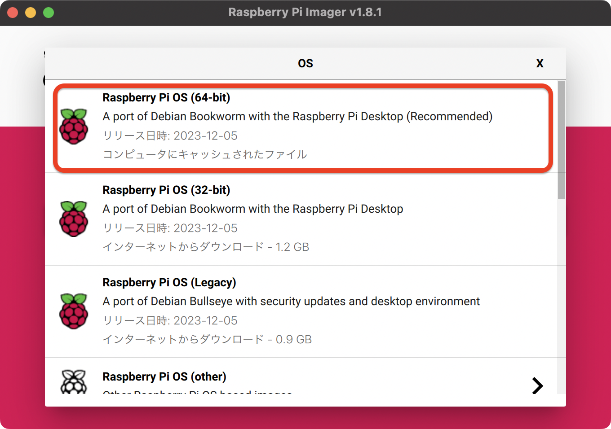
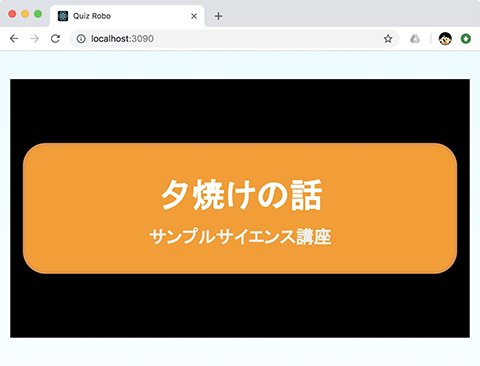
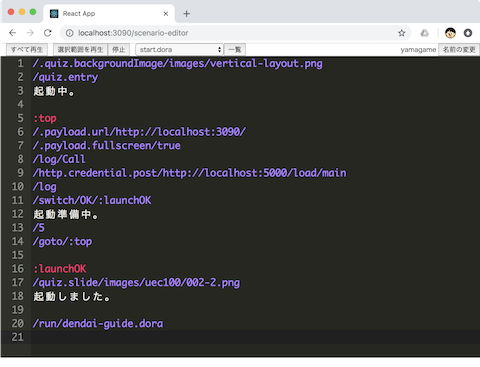

# Dora Engine

ラズベリーパイと [RasPi-VoiceBot](https://yamagame.github.io/dora-board) で作るコミュニケーションロボットエンジンです。

<p align="center">
  
</p>

## 特徴

- 音声認識、音声合成機能を持つ Raspberry Pi を使った手作りできるコミュニケーションロボットです。
- 部品代は AquesTalk Pi を含めて 3 万円ほどです。
- 専用スクリプト言語を使ってロボットのコントロールを簡単に行えます。
- 外部のパソコンなしにロボット単体で画像と連携したプレゼンテーションができます。
- 外装はダンボールですのでお好みに合わせて自由に変更できます。
- 言語の翻訳機能を持たせることもできます。

### 音声認識

音声認識はマイクに入力した音声を文字列に変換する機能です。
デフォルトでは Chrome の [Web Speech API Speech Recognition](https://developer.mozilla.org/ja/docs/Web/API/SpeechRecognition) を使います。

Speech API を使用するには https 接続か localhost 接続が必要です。Raspberry Pi で dora-engine を動かす場合は、そのままでは音声認識できませんので、Chrome ブラウザを開く PC に dora-engine へのプロキシー(nginxなど)を立てて接続します。

[プロキシーのサンプル / nginx-proxy](https://github.com/yamagame/nginx-proxy)

以下の URL を Chrome ブラウザで開き、localhost 接続で dora-engine へ接続します。

http://localhost:3090/browser-speech

あわせて以下の URL でシナリオを編集できます。

http://localhost:3090/scenario-editor

環境変数を設定することで以下の音声認識を選択することもできます。

- Google Speech-to-Text
- ReazonSpeech
- Whisper (Whisper は現在、正しく動作していません)

[Google Speech-to-Text](https://cloud.google.com/speech-to-text/) を使うことで以下のことができます。

- 多言語認識：日本語だけでなく外国語の認識もできます。
- 言語判定：入力した音声がどの言語のものなのかを判定できます。

ReazonSpeech を使用すると、インターネット接続なしで音声認識させることができます。

### 音声合成

音声合成には以下のものを選択できます。

- [OpenJTalk](http://open-jtalk.sp.nitech.ac.jp/)
- [AquesTalk Pi](https://www.a-quest.com/products/aquestalkpi.html) (linuxのみ/デフォルト)
- say コマンド (macのみ/デフォルト)
- [Google Text-to-Speech](https://cloud.google.com/text-to-speech/)
- [AWS Polly](https://aws.amazon.com/jp/polly/)

[Google Text-to-Speech](https://cloud.google.com/text-to-speech/) や [AWS Polly](https://aws.amazon.com/jp/polly/) を使うと外国語を話すことができます。

### 言語翻訳

言語翻訳には [Google Translation API](https://cloud.google.com/translate/) を使用します。

### 頭部の稼働

サーボモーター２つを使って頭が上下左右に動きます。頭の動きは自動的に行われます。何も指示がないときにはロボットの頭部は上下左右にランダムに動きます。ロボットがおしゃべりしているときは頭が上下に動きます。

### 専用スクリプト言語

専用のスクリプト言語を使ってシナリオを作成できます。シナリオで音声認識や音声合成、プレゼンテーション画面の切り替え、お腹のボタンのコントロールなどができます。シナリオはブラウザベースのエディタを使って編集できます。特定のシナリオを電源投入時に自動的に実行することもできます。

### プレゼンテーション

おしゃべりと連携してプレゼンテーション画像を表示することができます。プレゼンテーション画面は Raspberry Pi のブラウザに表示されます。外部モニタを接続することで Raspberry Pi の画面を表示することができますので、外部のパソコンなしにロボット単体でプレゼンテーションができます。

## ロボットの設計図

設計図は 1.5mm 厚ダンボール用と 3mm 厚ダンボール用の２つがあります。
ロボットは設計図の各ページを A4 サイズで印刷して、厚紙パーツはそのまま切り取り、ダンボールパーツはダンボールに貼り付けて切り取ります。

- 3mm 厚ダンボール用

  [http://bit.ly/2LkGgn4](http://bit.ly/2LkGgn4)

- 1.5mm 厚ダンボール用

  [http://bit.ly/2mmmfBG](http://bit.ly/2mmmfBG)

設計図は[クリエイティブコモンズライセンス](https://creativecommons.org/)で公開しています。

ロボットの組立方法は以下のリンク先のページを参考にしてください。

- [ロボット組立方法](http://bit.ly/2zTPUfn)

### ハードウェアの構成について

もともとは、Google の [Voice Kit V1](https://aiyprojects.withgoogle.com/voice-v1/) を利用したロボットでした。現在は販売されていませんので、市販の部品を組み合わせることで作ることができます。詳しくは以下のリンクを参照してください。

[https://yamagame.github.io/dora-board/](https://yamagame.github.io/dora-board/)

### サーボモーターについて

ダンボールロボットの設計図はマイクロサーボを２つ使う設計になっています。一つは頭部を左右に、もう一つは上下に動かします。しかし、Servo MG90D の様なマイクロサーボは稼働させ続けると壊れやすい様です。長時間動かす場合はマイクロサーボではなく、MG996R の様な大きめのサーボをオススメします。

[秋月電子：TowerPro MG996R](http://akizukidenshi.com/catalog/g/gM-12534/)

MG996R ではダンボールロボットのサイズに合いませんので上下の動きは諦めて左右の動きのサーボとして使用します。

## 準備

[Raspberry Pi OS](https://www.raspberrypi.org/downloads/) から Raspberry Pi OS をダウンロードして microSD カードを作成します。Raspberry Pi Imager を使用すると選択画面から OS を選ぶことができます。



OSは「Raspberry Pi OS (64-bit)」や「Raspberry Pi OS Lite (64-bit)」を選択します。

Raspberry Pi のターミナルで、以下のコマンドを入力して、ロボットエンジンをダウンロードします。

```
$ cd ~
$ git clone https://github.com/yamagame/dora-engine.git
```

dora-engine フォルダに移動して、setup-system.sh を実行します。

```
$ cd dora-engine
$ ./setup-system.sh
```

setup-nodejs.sh で NodeJS をセットアップします。 NodeJS は v18.13.0 以上をインストールします。このドキュメントを記入した時点では Debian Bookworm で NodeJS をインストールすると v18.13.0 になるようです。

```
$ ./setup-nodejs.sh
```

setup-open-jTalk.sh で Open JTalk をセットアップします。

```
$ ./setup-open-jTalk.sh
```

setup-autolaunch.sh で、自動起動の設定を行います。

```
$ ./setup-autolaunch.sh
```

再起動します。

### /boot/config.txt を編集する

I2S 接続の音声デバイスをりようする場合は以下の手順を進めます。dora-engine は I2S 接続の「MAX98357A」と「SPH0645LM4H」を利用することを前提として実装しています。

以下の項目をコメントアウトして無効化します。

```
#dtparam=audio=on
```

以下の３項目を記入して有効化します。

```
dtparam=i2s=on
dtoverlay=i2s-mmap
dtoverlay=googlevoicehat-soundcard
```

以下の行を編集して hdmi の音声出力を無効にします。

```
dtoverlay=vc4-kms-v3d,noaudio       # <== noaudio を追記
dtoverlay=dietpi-disable_hdmi_audio # <== 行追加
```

### /etc/asound.conf を作成

asound.confg を作成して、plug:softvol と plug:micboost デバイスを利用できるように設定します。

```
options snd_rpi_googlemihat_soundcard index=0

pcm.softvol {
    type softvol
    slave.pcm dmix
    control {
        name Master
        card 0
    }
}

pcm.micboost {
    type route
    slave.pcm dsnoop
    ttable {
        0.0 10
        1.1 10
    }
}

pcm.!default {
    type asym
    playback.pcm "plug:softvol"
    capture.pcm "plug:micboost"
}

ctl.!default {
    type hw
    card 0
}
```

## マイクとスピーカーをテストする

### 録音する場合

```
$ arecord -Dplug:micboost -f S16_LE -r 16000 test.wav
```

### 再生する場合

```
$ aplay -Dplug:softvol test.wav
```

## AquesTalk Pi の準備

デフォルトの音声合成は Open JTalk になってます。AquesTalk Pi を使用する場合は以下の手順で準備します。

ブラウザで以下の URL を開きます。

[https://www.a-quest.com/products/aquestalkpi.html](https://www.a-quest.com/products/aquestalkpi.html)

Download のセクションから、使用許諾を読んで「同意して Download」ボタンをクリックします。

Downloads フォルダに aquestalkpi-20220207.tar がダウンロードされますので、以下のコマンドでダウンロードしたファイルを DoraEngine のプロジェクトルートの modules ディレクトリに移動して解凍します。

```
$ mv ~/Downloads/aquestalkpi-20220207.tar ./modules
$ pushd modules
$ tar xvf aquestalkpi-20220207.tar
$ popd
```

以下のスクリプトを実行して必要なモジュールをインストールします。

```
$ ./scripts/setup-rpi-64bit.sh
```

以下のコマンドを入力して、音声合成のテストを行います。

```
$ cd ~/dora-engine
$ ./talk-f1.sh こんにちは
```

音声合成を Open JTalk から変更する場合は、環境変数 ROBOT_DEFAULT_VOICE の設定を外します。デフォルトで無効になってます。

[start-robot-server.sh](./start-robot-server.sh) の以下の行のコメントアウトを外します。

```
#export ROBOT_DEFAULT_VOICE=open-jTalk
```

再起動後、デフォルト音声合成が AquesTalk Pi になります。

## 音声認識

[Google Speech API](https://cloud.google.com/speech-to-text?hl=ja) と　[whisper.cpp](https://github.com/ggerganov/whisper.cpp) が選択できます。

## Chrome ブラウザの音声認識APIを使用する場合

```sh
# ロボットエンジンの起動
$ yarn start
```

```sh
# または環境変数を指定して起動
export SPEECH=browser
```

chrome ブラウザで http://localhost:3090/browser-speech を開きます。別のウインドウで http://localhost:3090/scenario-editor を開き、下記のスクリプトを実行します。

```sh
//オウム返し
:LOOP
/speech-to-text
/text-to-speech/{{speechText}}
/goto/:LOOP
```

初回はマイクの利用許可を求められますので許可します。ブラウザの音声認識を利用するにはインターネットが必要です。  
ブラウザの音声認識は chrome のみで機能します。音声認識できる時間は 15 秒間で 15 秒経つとタイムアウトします。

## Google Text-To-Speech API による音声認識の場合

環境変数 GOOGLE_APPLICATION_CREDENTIALS に使用する Google Cloud Project の認証ファイルへのパスを指定します。
認証ファイル (JSON ファイル) の取得方法については以下を参照してください。

[https://cloud.google.com/speech-to-text/docs/quickstart-client-libraries](https://cloud.google.com/speech-to-text/docs/quickstart-client-libraries)

GCP プロジェクトの Speech API を有効にします。

環境変数 SPEECH に google を設定します。

```
export SPEECH=google
```

音声認識のテストを行います。以下のコマンドをシナリオエディタに入力してエコーロボットになれば OK です。音声認識している最中はお腹のボタンが点灯します。

```
/speech-to-text
/text-to-speech
```

[Google Text-to-Speech](https://cloud.google.com/text-to-speech/) は最長で 60 秒間音声認識します。60 秒以上になるとエラーになります。そのため、DoraEngine では初期設定では 30 秒で音声認識はタイムアウトします。

## Google Translation API の準備

環境変数 GOOGLE_APPLICATION_CREDENTIALS で指定したプロジェクトの Translation API を有効にします。

環境変数 ROBOT_GOOGLE_TRANSLATE_PROJECT_ID に Google Cloud Project の ProjectID を設定します。

## ReazonSpeech による音声認識の場合

[https://github.com/yamagame/node-voice-recorder.git](https://github.com/yamagame/node-voice-recorder.git) を起動します。

node-voice-recorder では音声録音サーバと音声認識サーバを起動します。

```sh
# 音声認識サーバの起動
./scripts/start-server.sh
[nltk_data] Downloading package averaged_perceptron_tagger to
[nltk_data]     /root/nltk_data...
[nltk_data]   Unzipping taggers/averaged_perceptron_tagger.zip.
[nltk_data] Downloading package cmudict to /root/nltk_data...
[nltk_data]   Unzipping corpora/cmudict.zip.
INFO:     Started server process [157]
INFO:     Waiting for application startup.
INFO:     Application startup complete.
INFO:     Uvicorn running on http://0.0.0.0:9002 (Press CTRL+C to quit)
```

```sh
# 音声録音サーバの起動
$ ./scripts/connect-dora-engine.sh
dora-engineのIPアドレスを入力 > localhost
connecting localhost from 10.5.32.200
yarn run v1.23.0-20220130.1630
$ REAZONSPEECH_RAW=./work/out.raw ts-node -r tsconfig-paths/register src/index.ts
Vad | sampleRate: 48000 | hertzPerBin: 93.75 | iterationFrequency: 93.75 | iterationPeriod: 0.010666666666666666
Got SIGNAL startComplete
node-voice-recorder listening on port 3093!
```

dora-engine は音声録音サーバを中継して音声認識を行います。
環境変数 REAZON_SPEECH_HOST、REAZON_SPEECH_PORT に音声録音サーバのホストとポート番号を指定し、SPEECH を reazon にしてロボットエンジンを起動します。

```sh
# 設定例
export REAZON_SPEECH_HOST=localhost
export REAZON_SPEECH_PORT=3393
export SPEECH=reazon
```

## whisper.cpp による音声認識の場合

注意： whisper 連携は現在正しく動作していません。

whisper.cpp の使用方法は whisper.cpp に従いますので、whisper.cpp の README.md を参照してください。

/modules ディレクトリに https://github.com/ggerganov/whisper.cpp を clone します。
/modules/whisper.cpp ディレクトリで以下のコマンドを実行して、stream バイナリを作成します。

```bash
$ make stream
```

音声認識のモデルデータを以下のコマンドでダウンロードします。

```bash
$ bash ./models/download-ggml-model.sh ggml-large-v3
```

環境変数 SPEECH に whisper を設定して音声認識を有効化します。[robot-server.sh](./robot-server.sh) の以下の行を書き換えます。

```sh
export SPEECH=whisper
```

## プレゼンテーション画面

<p align="center">
  
</p>

ブラウザで以下の URL を開きます。

    http://[dora-engineのIPアドレス]:3090/

この画面にコマンドで指示したスライドなどが表示されます。シナリオを作ることでスライドと連動したプレゼンテーションロボットとして稼働させることができます。

Chrome ブラウザで音声認識させる場合は以下の URL を開きます。

    http://locahost:3090/browser-speech

## シナリオエディター画面

<p align="center">
  
</p>

シナリオエディターを使ってロボットをコントロールすることができます。

ブラウザで以下の URL を開きます。

    http://[dora-engineのIPアドレス]:3090/scenario-editor/

あなたのお名前のエリアに名前を入力します。名前はなんでもよいです。

テキストエディターが開きますので、そこに適当に会話文書を入力します。

## シナリオ言語仕様

特殊行以外はロボットが読み上げる文章です。空行は 1 秒のウエイトとして機能します。

下記はスライドをめくりながら解説するスクリプトの例です。

```
みなさん、こんにちは。
それでは、サイエンス講座を始めたいと思います。

今回は、夕焼けの話です。

/slide/images/sunset/002.jpeg

夕焼けは、日没の頃に西の空が赤く見える現象のことです。


/slide/images/sunset/003.jpeg

地球の大気は、太陽からの青いろの光を拡散する性質を持っています。
```

スクリプトの詳細は [DoraScript Language Specification](./docs/DORA-SCRIPT.md)
 を参照してください。

### コメント

行頭が//だとコメント行になります。

```
//ここはコメント
```

### コマンド

行頭が/から始まるとコマンド行になります。

```
/.payload/おはようございます
```

### ラベル

行頭が:から始まるとラベル行になります。

## 関連プロジェクト

### Dora Editor

[https://github.com/yamagame/dora-editor](https://github.com/yamagame/dora-editor)

### Dora Script Sample

[https://github.com/yamagame/dora-script-sample](https://github.com/yamagame/dora-script-sample)

### ドキュメント詳細

[https://yamagame.github.io/dora-engine-doc/](https://yamagame.github.io/dora-engine-doc/)

## ライセンス

[MIT](LICENSE)
