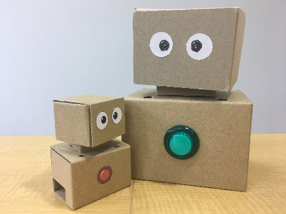

# Dora Engine

ラズベリーパイとVoiceKitで作るコミュニケーションロボットエンジンです。

<p align="center">
  
</p>

## 機能

- [Speech-to-Text Client Libraries](https://cloud.google.com/speech-to-text/docs/reference/libraries) を使って音声認識ができます。
- [AquesTalk Pi](https://www.a-quest.com/products/aquestalkpi.html) を使って音声合成ができます。他の音声合成エンジンに変更することもできます。
- サーボ２つで、ロボットの頭部を２軸動作できます。
- Node-REDとの連携でコントロールできます。
- 専用スクリプト([DoraScript](https://github.com/yamagame/dora))を使ってブラウザ経由でコントロールできます。
- 自動プレゼンテーション機能
- 音声認識によるQ&A機能
- [ドコモ雑談対話API](https://dev.smt.docomo.ne.jp/?p=docs.api.page&api_name=natural_dialogue&p_name=api_4_usage_scenario#tag01)に対応しています

## ロボットの設計図

設計図は1.5mm厚ダンボール用と3mm厚ダンボール用の２つがあります。
ロボットは設計図の各ページをA4サイズで印刷して、厚紙パーツはそのまま切り取り、ダンボールパーツはダンボールに貼り付けて切り取ります。

- 3mm厚ダンボール用

    [http://bit.ly/2LkGgn4](http://bit.ly/2LkGgn4)

- 1.5mm厚ダンボール用

    [http://bit.ly/2mmmfBG](http://bit.ly/2mmmfBG)

設計図は[クリエイティブコモンズライセンス](https://creativecommons.org/)で公開しています。

ロボットの組立方法は以下のリンク先のページを参考にしてください。

- [ロボット組立方法](http://bit.ly/2zTPUfn)

## 準備

SDカードを作成します。ここでは、Google Voice Kitの2017/09/11バージョンを使用します。その他のバージョンで動作させる場合は、次のセクションをご覧ください。

[https://dl.google.com/dl/aiyprojects/voice/aiyprojects-2017-09-11.img.xz](https://dl.google.com/dl/aiyprojects/voice/aiyprojects-2017-09-11.img.xz)

ラズベリーパイのターミナルで、以下のコマンドを入力して、ロボットエンジンをダウンロードします。

```
$ cd ~
$ git clone https://github.com/yamagame/dora-engine
```

dora-engineフォルダに移動して、setup-system.shを実行します。

```
$ cd dora-engine
$ ./setup-system.sh
```

setup-nodejs.shでNode.jsをセットアップします。

```
$ ./setup-nodejs.sh
```

setup-node-red.shでNode-REDをセットアップします。

```
$ ./setup-node-red.sh
```

setup-autolaunch.shで、自動起動の設定を行います。

```
$ ./setup-autolaunch.sh
```

再起動します。

## aiyprojects-2017-09-11.img.xz 以外の Raspbian で動作させる方法

NOOBS_v2_8_2 でのみ確認しています。

### 8GByteのSDカードを使用している場合

SDカードの容量が足りませんので、以下のコマンドで wolfram-engine を削除して空き容量を確保します。

```
$ sudo apt-get purge wolfram-engine -y
```

### /boot/config.txtを編集する

以下の項目をコメントアウトして無効化します。

```
dtparam=audio=on
```

以下の３項目を記入して有効化します。

```
dtparam=i2s=on
dtoverlay=i2s-mmap
dtoverlay=googlevoicehat-soundcard
```

### /etc/asound.confを作成

```
options snd_rpi_googlemihat_soundcard index=0

pcm.softvol {
    type softvol
    slave.pcm dmix
    control {
        name Master
        card 0
    }
}

pcm.micboost {
    type route
    slave.pcm dsnoop
    ttable {
        0.0 30.0
        1.1 30.0
    }
}

pcm.!default {
    type asym
    playback.pcm "plug:softvol"
    capture.pcm "plug:micboost"
}

ctl.!default {
    type hw
    card 0
}
```

## 録音再生をテストする

### 録音する場合

```
arecord -Dplug:micboost -f S16_LE -r 16000 test.wav
```

### 再生する場合

```
aplay -Dplug:softvol test.wav
```

## AquesTalk Piの準備

ブラウザで以下のURLを開きます。

[https://www.a-quest.com/products/aquestalkpi.html](https://www.a-quest.com/products/aquestalkpi.html)

Downloadのセクションから、使用許諾を読んで「同意してDownload」ボタンをクリックします。

Downloadsフォルダにファイルがダウンロードされますので、以下のコマンドを入力して解凍します。

```
$ cd ~/Downloads
$ tar xvf aquestalkpi-20130827.tgz
```

以下のコマンドを入力して、音声合成のテストを行います。

```
$ cd ~/dora-engine
$ talk-f1.sh こんにちは
```

## Google Speech APIの準備

下記のページにしたがって準備します。google-cloud-sdkのインストールは、setup-system.shですでにインストールしていますので不要です。SDKの初期化のセクションから進めます。

[https://cloud.google.com/sdk/docs/quickstart-debian-ubuntu](https://cloud.google.com/sdk/docs/quickstart-debian-ubuntu)

以下のコマンドを実行して、メッセージにしたがって設定します。

```
$ gcloud init
```

以下のコマンドを実行して、作成したプロジェクトをデフォルトプロジェクトに設定します。

```
$ export GCLOUD_PROJECT=[作成したプロジェクトID]
$ gcloud auth application-default login
```

音声認識のテストを行います。以下のコマンドを入力して、マイクに向かって話します。話した言葉がテキスト化されれば成功です。

```
$ cd ~/dora-engine
$ node speech.js
```

## docomo雑談対話APIの準備

[docomo Developer support](https://dev.smt.docomo.ne.jp/?p=docs.api.page&api_name=natural_dialogue&p_name=api_4_usage_scenario#tag01) のページから、雑談対話のAPIキーを取得して、環境変数 DOCOMO_API_KEY に設定します。

```
export DOCOMO_API_KEY=7570304351643...................
```

以下のコマンドを実行して、雑談対話のappIdを取得します。

```
$ ./setup_docomo_appid.sh
{"appId":"eb9xxxxx-xxxx-xxxx-xxxx-xxxxxxxxxxxx"}
```

appIdとして出力された文字列を、環境変数 DOCOMO_APP_ID に設定します。

```
export DOCOMO_APP_ID=eb9xxxxx-xxxx-xxxx-xxxx-xxxxxxxxxxxx
```

## DoraEditorの使い方

ブラウザで以下のURLを開きます。

```
http://localhost:3090/scenario-editor/
```

あなたのお名前のエリアに名前を入力します。名前はなんでもよいです。

テキストエディターが開きますので、そこに適当に会話文書を入力します。

## 関連プロジェクト

### Dora Script
[https://github.com/yamagame/dora](https://github.com/yamagame/dora)

### Dora Editor
[https://github.com/yamagame/dora-editor](https://github.com/yamagame/dora-editor)

### Dora Admin
[https://github.com/yamagame/dora-admin](https://github.com/yamagame/dora-admin)

### Dora Quiz
[https://github.com/yamagame/dora-quiz](https://github.com/yamagame/dora-quiz)

### Dora Script Sample
[https://github.com/yamagame/dora-script-sample](https://github.com/yamagame/dora-script-sample)

## ライセンス

[MIT](LICENSE)
