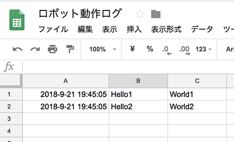

# 動作ログをGoogleスプレッドシートに記録する

<p align="center">
  
</p>

### credentials.jsonの取得

以下のURLのStep1に従ってcredentials.jsonを取得します。

```
https://developers.google.com/sheets/api/quickstart/nodejs
```

### 環境変数の設定

環境変数、ROBOT_GOOGLE_SHEET_CREDENTIAL_PATHとROBOT_GOOGLE_SHEET_TOKEN_PATHに、
APIクレデンシャルと、トークンのパスを設定します。

```
export ROBOT_GOOGLE_SHEET_CREDENTIAL_PATH=[credentials.jsonへのファイルパス]
export ROBOT_GOOGLE_SHEET_TOKEN_PATH=[トークンファイルを保存するファイルパス]
```

下記は設定例です。

```
export ROBOT_GOOGLE_SHEET_CREDENTIAL_PATH=~/.config/robot/sheet-api-credentials.json
export ROBOT_GOOGLE_SHEET_TOKEN_PATH=~/.config/robot/sheet-api-token.json
```

### トークンの取得

シートにアクセスするためのトークンを取得します。

```
$ node google-router.js
```

指示にしたがって、コードを入力してトークンを保存します。

トークンの保存先は、ROBOT_GOOGLE_SHEET_TOKEN_PATHで指定したファイルです。

### スプレッドシートに書き込むドラスクリプト

スプレッドシートに書き込むドラスクリプトの例です。

```
/.googleSheetId/[シートID]
/append-to-google-sheet/Hello1/World1
/append-to-google-sheet/Hello2/World2
```

シートIDの部分には、スプレッドシートIDを記入します。
シートIDはスプレッドシートのURLが以下の場合、1qpyC0XzvTcKT6EISywvqESX3A0MwQoFDE8p-Bll4hpsです。

```
https://docs.google.com/spreadsheets/d/1qpyC0XzvTcKT6EISywvqESX3A0MwQoFDE8p-Bll4hps/edit#gid=0
```

以下のようにします。

```
/.googleSheetId/1qpyC0XzvTcKT6EISywvqESX3A0MwQoFDE8p-Bll4hps
/append-to-google-sheet/Hello1/World1
/append-to-google-sheet/Hello2/World2
```

データはスラッシュ区切りでカラムに書き込まれます。

以下のようにすると、音声認識の結果をスプレッドシートに書き込むことができます。

```
/.googleSheetId/[シートID]
/speech-to-text
/append-to-google-sheet/{{payload}}
```
